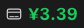

# dsh-plugins

[English](README.md) | 中文

[DeepSeek Harness](https://github.com/deepseek-ai/deepseek-harness) 社区插件集合——每个插件都是独立 bundle，一键安装、独立版本。

## 插件列表

| 插件 | 效果 | 说明 | 安装 |
|---|---|---|---|
| **dsh-balance-plugin** |  | 侧边栏底部显示 DeepSeek 钱包余额：信用卡图标 + 状态色金额（≥2 绿 / 0~2 黄 / ≤0 红），对话结束自动刷新、点击刷新 | `dsh plugin add dsh-balance-plugin` |

## 安装方式

**方式一：npm（推荐，一条命令）**

`<profile>` 是你的 profile 名——即 `~/.dsh/profiles/` 下的配置组合名，运行 `ls ~/.dsh/profiles/` 可查看；一般就是 `web`（带网页界面）或 `headless`（无界面）：

```sh
dsh plugin --profile <profile> add dsh-balance-plugin
```

**方式二：GitHub Release**——从 [Releases](https://github.com/luokai-demo/dsh-plugins/releases) 下载 `dsh-balance-plugin-0.1.0.tgz`，然后：

```sh
dsh plugin --profile <profile> add ./dsh-balance-plugin-0.1.0.tgz
```

安装后重启 `dsh web` 并刷新浏览器，余额显示在侧边栏底部（设置按钮旁）。

## 交给 AI 安装

把下面这句发给任意能操作终端的 AI，即可自动完成安装（`<profile>` 换成你的 profile 名，如 `web`）：

> 请帮我给 DeepSeek Harness 安装 dsh-balance-plugin 插件：先运行 `dsh plugin --profile <profile> add dsh-balance-plugin`；如果 npm 上没有（报错 E404），就从 https://github.com/luokai-demo/dsh-plugins/releases 下载最新的 dsh-balance-plugin-*.tgz，再运行 `dsh plugin --profile <profile> add ./dsh-balance-plugin-*.tgz`；安装后用 `dsh --profile <profile> --dump-config` 确认出现 dsh-balance-plugin 层，然后重启 dsh web 并硬刷新浏览器（Cmd+Shift+R），最后确认侧边栏底部出现信用卡图标和余额数字。

## 开发与发布

新增插件、构建测试、双渠道发布的完整流程见 [DEVELOPING.md](DEVELOPING.md)。每个插件目录内有自己的 README 与发布手册。

## 许可

[MIT](LICENSE)
